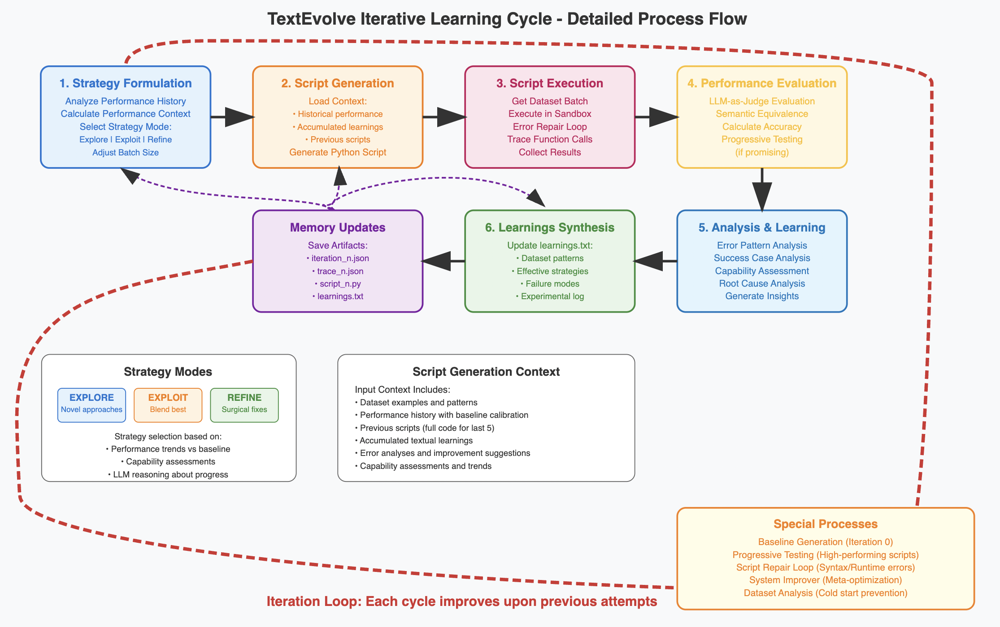
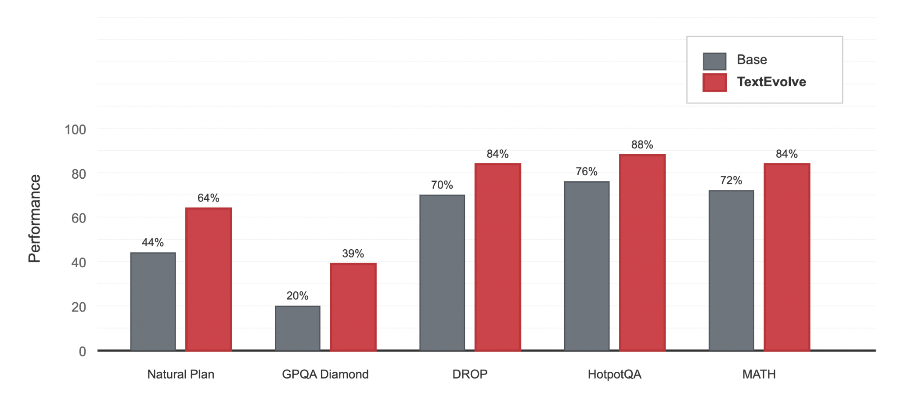
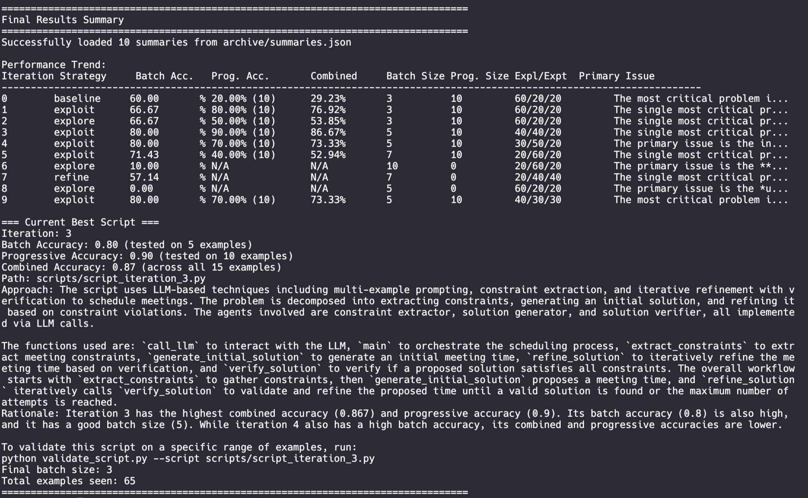

# TextEvolve



TextEvolve is a system that uses LLM-driven reasoning and memory to iteratively improve its approach to solving problems from datasets. TextEvolve automates the labor-intensive task of iterating over system design, prompt engineering, and program flow by learning, remembering, and adapating its approach. 

**Input:** Any dataset with "question" and "answer" fields 

**Output:** A series of executable python scripts containing advanced workflows and agentic behavior optimized for the dataset.

The system employs dynamic exploration/exploitation/refinement strategies and adapts its approach (creating new functions, writing code that generates and executes new code, writing prompts, etc.) based on performance feedback, keeping rich logs of its past performance.

## 📄 Paper & Demo

**📖 Read the Paper:** [TextEvolve: Automated Program Discovery with Large Language Models](https://drive.google.com/file/d/11ZOOjVJeDfmoP1-sabi8lVWO9UEifZlP/view?usp=sharing)

**🎥 Watch the Demo:** [YouTube](https://youtu.be/QS-Mzb7P_9w)

**📁 Examples in Action:** 

[System-generated script for MATH dataset](examples/MATH_script.py)

[System-generated script for GPQA Diamond dataset](examples/GPQA_script.py)

[System-generated script for HotpotQA dataset](examples/HOTPOTQA_script.py)

[System-generated script for DROP dataset](examples/DROP_script.py)

[Memory / experiment log for HotpotQA](examples/HOTPOTQA_learnings.txt)


🚧 **Repository Status: Under Construction** 🚧

**Current State:**
- ✅ TextEvolve is stable and runs successfully
- 🔄 Codebase is actively being refactored and cleaned up
- 📝 Documentation and examples are being written
- 🏗️ Repository structure may change frequently

Please expect ongoing changes to code organization and documentation as we work toward a more polished release.

⚠️ **EXPERIMENTAL:** The system also includes a meta self-modifying loop (system_improver.py) that uses higher order prompt instructions to edit itself. This functionality is still under review. ⚠️

**Preliminary Results:**

Here's some preliminary benchmark data from the paper comparing standard I/O with Gemini 2.0 Flash vs. the best performing TextEvolve program run with Gemini 2.0 Flash. (NB: Run over 100 randomly sampled examples from the test set - more extensive benchmarking is underway). TextEvolve boosts performance by automating manual experimenting over workflows, prompts, and code.

Program search is typically completed (20-30 iterations) in around **20-30 minutes** over **~100 data examples** for **\$.05-$.10** in Gemini credits.



---

 

## 🚀 Quick Start

⚠️ TextEvolve has the ability to write code, execute code, and install new libraries - please run the system in a safe or sandboxed environment ⚠️

1. **Set your Gemini API key:**
   ```bash
   export GEMINI_API_KEY=your_api_key_here
   ```

2. **Run the system:**
   ```bash
   # Basic usage with 5 iterations
   python run_script.py --dataset your_dataset.jsonl --loader jsonl --iterations 5

   # Example with MATH benchmark
   python run_script.py --dataset hendrycks_math/math_test.jsonl --loader math --iterations 5
   ```

Program search is typically completed (20-30 iterations) in around **20-30 minutes** over **~100 data examples** for **\$.05-$.10** in Gemini credits.

You can run more iterations if you're unsatisfied with the result. This will pick up right where the system left off. After the system runs you'll see a final report:



4. **Validate results:**
   ```bash
   # Test the best script on examples 100-199
   python validate_script.py --script scripts/script_iteration_4.py --dataset hendrycks_math/math_test.jsonl --loader math --start 100 --end 199
   ```

5. **Reset system:**
   ```bash
   # Wipe memory and start the system from scratch
   python reset_system.py
   ```

## 📊 Supported Dataset Formats

The system supports multiple dataset formats through modular loaders:

### Built-in Loaders

| Loader | Dataset Type | Example Usage |
|--------|--------------|---------------|
| `arc` | ARC (Abstraction and Reasoning Corpus) | `--loader arc` |
| `jsonl` | JSONL files (one JSON per line) | `--loader jsonl` |
| `json` | JSON files with configurable fields | `--loader json` |
| `simpleqa` | SimpleQA dataset | `--loader simpleqa` |
| `math` | MATH dataset | `--loader math` |
| `natural_plan` | Natural Plan dataset | `--loader natural_plan` |
| `gpqa` | GPQA dataset | `--gpqa` |
| `hotpotqa` | HotpotQA dataset | `--gpqa` |
| `custom` | Your own custom format | `--loader custom` |

### Usage Examples

```bash
# ARC dataset (directory of JSON files)
python run_script.py --dataset ARC_2024_Training/ --loader arc --iterations 10

# JSONL dataset (like MATH benchmark)
python run_script.py --dataset math_test.jsonl --loader math --iterations 5

# Custom JSON with specific fields
python run_script.py --dataset custom.json --loader json --input-field question --output-field answer --iterations 5

# JSONL with custom fields (like DROP dataset)
python run_script.py --dataset drop_dataset.jsonl --loader jsonl --input-field question --output-field answers_spans --iterations 5

# Disable shuffling for consistent ordering
python run_script.py --dataset dataset.jsonl --loader jsonl --no-shuffle --iterations 5
```

## 🔧 Command Line Options

### run_script.py

| Option | Description | Default |
|--------|-------------|---------|
| `--iterations` | Number of iterations to run | 5 |
| `--dataset` | Path to dataset file/directory | required |
| `--loader` | Type of dataset loader | required |
| `--input-field` | Input field name (JSON/JSONL) | "input" |
| `--output-field` | Output field name (JSON/JSONL) | "output" |
| `--passage-field` | Passage field (JSONL) | "passage" |
| `--no-shuffle` | Disable dataset shuffling | False |
| `--seed` | Random seed | 42 |

### validate_script.py

| Option | Description | Default |
|--------|-------------|---------|
| `--script` | Path to script to validate | required |
| `--dataset` | Path to dataset | required |
| `--loader` | Dataset loader type | required |
| `--start` | Start index for validation | 0 |
| `--end` | End index for validation | 99 |
| `--detailed` | Show detailed results | False |

## 🏗️ Creating Custom Dataset Loaders

### Method 1: Simple Custom Loader

For basic custom formats, extend the `DatasetLoader` class:

```python
from dataset_loader import DatasetLoader
import json

class MyDatasetLoader(DatasetLoader):
    def _load_examples(self):
        """Load examples from your custom format"""
        with open(self.dataset_path, 'r') as f:
            data = json.load(f)

        for key, example in data.items():
            # Convert to standard format
            self.examples.append({
                "id": key,
                "question": example["my_input_field"],  # Standard field: "question"
                "answer": example["my_output_field"],   # Standard field: "answer"
                "meta": {
                    "source": "my_dataset",
                    "original_data": example
                }
            })

        print(f"Loaded {len(self.examples)} examples from custom dataset")

# Register and use your loader
from dataset_loader import create_dataset_loader

def create_my_loader(**kwargs):
    return MyDatasetLoader(**kwargs)

# Add to the create_dataset_loader function or use directly
loader = MyDatasetLoader(dataset_path="my_data.json", shuffle=True)
```

### Method 2: Using the Custom Loader Framework

For more complex formats, use the built-in custom loader:

```python
from dataset_loader import create_dataset_loader

def load_my_examples(dataset_path):
    """Load examples from your dataset"""
    # Your custom loading logic
    with open(dataset_path, 'r') as f:
        raw_data = f.read()

    # Process and return list of examples
    examples = []
    # ... your processing logic ...
    return examples

def get_my_input(example):
    """Extract input from example"""
    return example["my_question_field"]

def get_my_output(example):
    """Extract output from example"""
    return example["my_answer_field"]

# Create the custom loader
loader = create_dataset_loader(
    "custom",
    dataset_path="my_dataset.xyz",
    load_examples_fn=load_my_examples,
    get_input_fn=get_my_input,
    get_output_fn=get_my_output,
    shuffle=True
)

# Use with agent system
from agent_system import AgentSystem
agent = AgentSystem(dataset_loader=loader)
```

## 📈 How It Works

### 1. Adaptive Strategy

The system uses three main strategies:
- **Explore** (60% initially): Try completely new approaches
- **Exploit** (20% initially): Combine successful techniques  
- **Refine** (20% initially): Make targeted improvements to the best script

The balance between these strategies adapts based on performance.

### 2. Progressive Testing

- Starts with small batches (3-5 examples)
- For promising scripts (>60% accuracy), runs progressive testing (backtesting) on a set of previously seen examples
- Adjusts batch size based on performance, balancing throughput with acquiring accurate measurement of itertation performance

### 3. LLM-Driven Improvements

- Uses LLM reasoning for strategy decisions, error analysis, and script generation
- Employs and creates novel advanced agentic patterns like ReAct, chain-of-thought, and verification loops
- Automatically repairs and debugs generated scripts

### 4. Example Workflow

```
Iteration 0: Baseline script (simple LLM call) → 45% accuracy
Iteration 1: Explore new approach → 62% accuracy → Progressive testing → 58% overall
Iteration 2: Exploit successful techniques → 71% accuracy → Progressive testing → 65% overall  
Iteration 3: Refine best approach → 73% accuracy → Progressive testing → 68% overall
...
```


## Quick Setup

### 1. Install uv (if not already installed)

**macOS/Linux:**
```bash
curl -LsSf https://astral.sh/uv/install.sh | sh
```

### 2. Clone and Setup Project

```bash
# Clone the repository
git clone <www.github.com/nickcdryan/textevolve>

# Install dependencies (creates virtual environment automatically)
uv sync

# Set up your Gemini API key
export GEMINI_API_KEY=your_api_key_here
```

### 3. Verify Installation

```bash
# Run the verification script
uv run python verify_setup.py

# Quick test run (optional)
uv run python run_script.py --dataset hendrycks_math/math_test.jsonl --loader math --iterations 1
```

## 📁 Output Structure

The system creates several directories:

```
├── archive/                 # Iteration data and summaries
│   ├── iteration_0.json    # Detailed data for each iteration
│   ├── iteration_1.json
│   └── summaries.json      # Performance summaries
├── scripts/                # Generated scripts
│   ├── script_iteration_0.py
│   ├── script_iteration_1.py
│   └── ...
├── learnings.txt           # Accumulated insights and patterns
└── README.md
```

## 🎯 Performance Tracking

The system tracks multiple metrics:

- **Batch Accuracy**: Performance on current test batch
- **Progressive Accuracy**: Performance on small set of previously seen examples  
- **Combined Accuracy**: Weighted average across all tested examples
- **Capability Assessment**: Strengths, weaknesses, and improvement areas

Example output:
```
Iteration  Strategy     Batch Acc.   Prog. Acc.      Combined    Batch Size  Prog. Size
8          exploit      75.00%       68.33% (60)     69.23%      4           60
```

## EXPERIMENTAL: Meta Self-Improvement

system_improver.py has access to review and edit the core functionality of the repository. Specifically, system_improver.py 
1) reviews the program
2) reviews iteration history and performance
3) reviews past changes made by system_improver.py in /diffs
4) proposes and integrates changes to the system, e.g. adding utility function, rewriting meta-agent prompts, etc.
5) creates system backups in /backup (eventually auto-rollback will be integrated if the new changes are system-breaking)

This system does not reliably work yet, please stay tuned.


## 🛠️ Advanced Usage

### Programmatic Usage

```python
from dataset_loader import create_dataset_loader
from agent_system import AgentSystem

# Create dataset loader
loader = create_dataset_loader(
    "jsonl",
    dataset_path="your_dataset.jsonl",
    shuffle=True,
    random_seed=42
)

# Initialize agent system
agent = AgentSystem(dataset_loader=loader)

# Run iterations
for i in range(10):
    result = agent.run_iteration()
    print(f"Iteration {i}: {result.get('performance', {}).get('accuracy', 0):.2f} accuracy")

# Get best script info
best_script = agent.get_best_script_info()
print(f"Best script: {best_script.get('path')} with {best_script.get('combined_accuracy', 0):.2f} accuracy")
```

### Custom Field Mapping

For datasets with non-standard field names:

```bash
# JSON dataset with custom fields
python run_script.py --dataset custom.json --loader json --input-field "problem_statement" --output-field "solution"

# JSONL dataset with passage and question
python run_script.py --dataset reading_comprehension.jsonl --loader jsonl --input-field "question" --passage-field "context" --output-field "answer"
```

## Potential Roadmap Features
- Parallelized batch testing
- Support for multi-turn flows
- system_improver.py iteration
- Better code execution
- Custom evaluation and multi-objective functions
- Integrate RAG capability
- More dynamic memory selection (access and reasoning over memory filesystem) 
- Further metaheuristic testing
- API, tool, modality (vision) integration


## 🤝 Contributing

To add support for a new dataset format:

1. Create a new loader class inheriting from `DatasetLoader`
2. Implement the `_load_examples()` method
3. Ensure examples use standard field names: `"question"`, `"answer"`, `"id"`
4. Add your loader to the `create_dataset_loader()` function
5. Test with both `run_script.py` and `validate_script.py`

## 📜 License

MIT License - see LICENSE file for details.