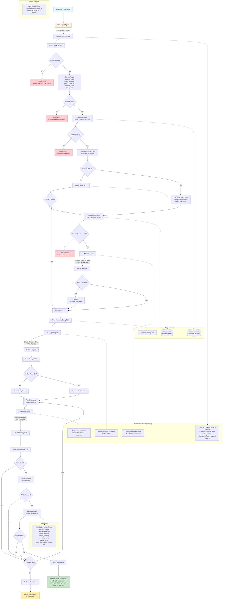

```mermaid
flowchart TD
    A[Customer Ticket Input] --> B[LLM Expert Agent]
    B --> |Extract with Examples| C[Information Extraction]
    
    C --> D[Parse JSON Output]
    D --> E{Extraction Valid?}
    E --> |No| F[Return Error:<br/>Failed to extract information]
    E --> |Yes| G[Extract Fields:<br/>customer_email, issue_summary<br/>explicit_order_id, product_name<br/>ticket_date]
    
    G --> H{Email Found?}
    H --> |No| I[Return Error:<br/>Customer email not found]
    H --> |Yes| J[Database Query:<br/>Find Customer by Email]
    
    J --> K{Customer Found?}
    K --> |No| L[Return Error:<br/>Customer not found]
    K --> |Yes| M[Retrieve Customer Data:<br/>customer_id, name]
    
    M --> N{Explicit Order ID?}
    N --> |Yes| O[Query Order by ID]
    N --> |No| P[Calculate Date Range<br/>60 days before ticket<br/>7 days after ticket]
    
    O --> Q{Order Found?}
    Q --> |No| R[Get Recent Orders<br/>Last 5 orders in range]
    Q --> |Yes| S[Order Retrieved]
    
    P --> R
    R --> T{Recent Orders Found?}
    T --> |No| U[Return Error:<br/>No recent orders found]
    T --> |Yes| V[LLM Expert Agent]
    
    V --> |Analyze Orders vs Issue<br/>Select Best Match| W[Order Selection]
    W --> X{Valid Selection?}
    X --> |No| Y[Fallback:<br/>Most Recent Order]
    X --> |Yes| S
    Y --> S
    
    S --> Z[Read Company Policy File]
    Z --> AA[LLM Expert Agent]
    AA --> |Extract Relevant Rules<br/>with Policy IDs| BB[Policy Analysis]
    
    BB --> CC[Parse Policy JSON]
    CC --> DD{Policy Parse OK?}
    DD --> |No| EE[Empty Policy Rules]
    DD --> |Yes| FF[Relevant Policies List]
    
    EE --> GG[Resolution Loop<br/>Max 3 Attempts]
    FF --> GG
    
    GG --> HH[LLM Expert Agent]
    HH --> |Generate Resolution<br/>with Examples| II[Resolution Proposal]
    
    II --> JJ[Parse Resolution JSON]
    JJ --> KK{Valid JSON?}
    KK --> |No| LL{Attempts Left?}
    LL --> |Yes| GG
    LL --> |No| MM[Fallback Resolution]
    
    KK --> |Yes| NN[Validate Fields &<br/>Action Types]
    NN --> OO{All Fields Valid?}
    OO --> |No| LL
    OO --> |Yes| PP[Validate Actions<br/>Against Allowed List]
    
    PP --> QQ{Actions Valid?}
    QQ --> |No| LL
    QQ --> |Yes| RR[Final Resolution]
    
    MM --> SS[Output: Investigation<br/>+ Escalation]
    RR --> TT[Output: JSON Resolution<br/>order_id, customer_id<br/>actions, escalation_required<br/>policy_references]
    
    subgraph "Single AI Agent"
        B2[LLM Expert Agent<br/>Information Extraction &<br/>Validation & Decision Making]
    end
    
    subgraph "Data Sources"
        J1[(Customer Database)]
        Z1[Company Policy File]
        O1[(Orders Database)]
    end
    
    subgraph "Validation"
        PP1[Hardcoded Action Types:<br/>process_return, send_replacement<br/>provide_tracking, honor_warranty<br/>request_photo, cancel_order<br/>deny_return, deny_refund, etc.]
    end
    
    subgraph "Examples-Based Prompting"
        C1[Example 1: Extract email & order ID<br/>Example 2: Extract from date context<br/>Example 3: Return request parsing]
        V1[Order Selection Examples<br/>Based on issue context]
        AA1[Policy Extraction Examples<br/>With rule IDs]
        HH1[Resolution Examples<br/>Different scenarios & outcomes]
    end
    
    J -.-> J1
    Z -.-> Z1
    O -.-> O1
    R -.-> O1
    PP -.-> PP1
    C -.-> C1
    V -.-> V1
    AA -.-> AA1
    HH -.-> HH1
    
    style A fill:#e1f5fe
    style TT fill:#c8e6c9
    style F fill:#ffcdd2
    style I fill:#ffcdd2
    style L fill:#ffcdd2
    style U fill:#ffcdd2
    style SS fill:#ffecb3
    style B fill:#fff3e0
```